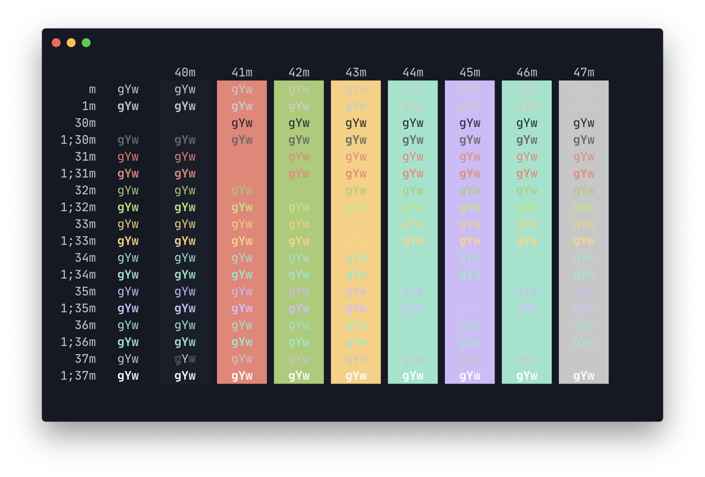

# hyper-mayukai

> Dark [Hyper](https://hyper.is) theme with bright colors - based off the [VSCode Theme Mayukai](https://github.com/GulajavaMinistudio/Mayukai-Theme)



## Install

```
$ hyper i hyper-mayukai
```

## Tip

To get the exact same look as in the screenshot, you need to use the [Pure](https://github.com/sindresorhus/pure) prompt, [Jetbrains Mono](https://www.jetbrains.com/lp/mono/) font, and the [zsh-syntax-highlighting](https://github.com/zsh-users/zsh-syntax-highlighting) plugin to have commands highlighted.
